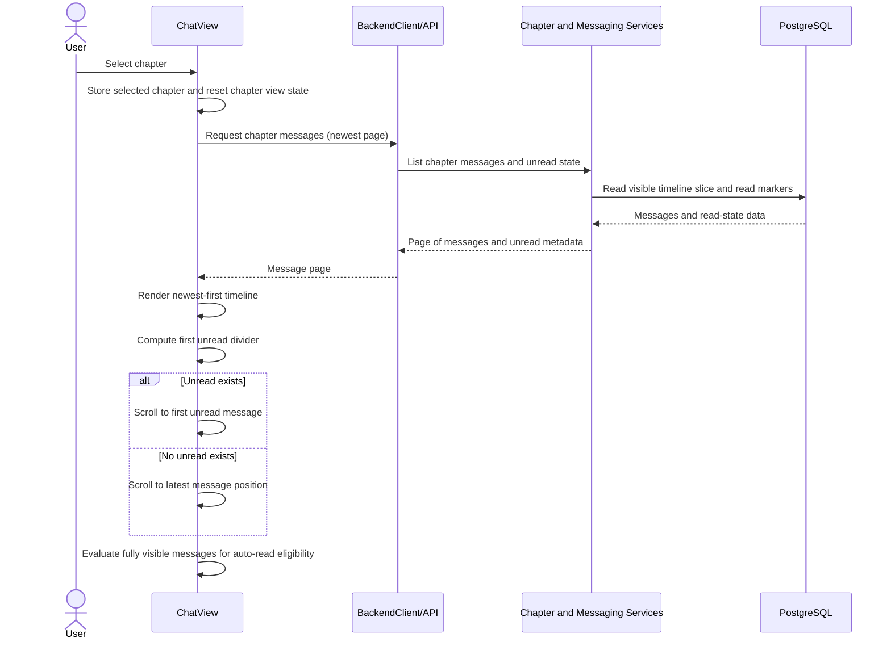
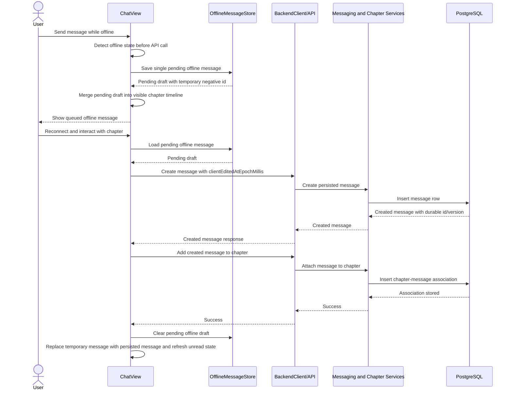
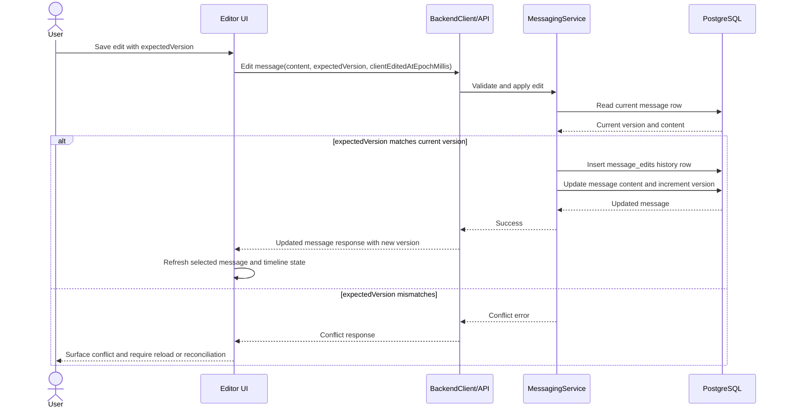

# Chat Application System Specification

## Purpose

This document captures the current system design as an implementation-facing specification.
It is intended to support change-request analysis by making the existing boundaries,
contracts, invariants, and tradeoffs explicit.

This specification describes the current implemented system, not an aspirational target.

## Scope

The specification covers:

- backend layering and composition
- shared API contract between frontend and backend
- chapter-based messaging behavior
- unread tracking and auto-read behavior
- offline caching and offline draft behavior
- message edit concurrency and history
- architecture governance checks

It does not attempt to fully specify every endpoint or UI detail.

## System Context

The application is a chapter-oriented chat system with:

- a Scala 3 backend built with ZIO and PostgreSQL
- a Scala.js frontend built with Laminar
- a shared protocol module used by both frontend and backend
- observability infrastructure for metrics, traces, and logs

Primary user capabilities include:

- authentication and session management
- chapter creation and access control
- message creation, editing, deletion, and search
- unread tracking and read-state updates
- offline viewing of cached chapter messages
- limited offline draft creation and editing

## Primary Design Structure

### Backend layers

The backend follows a layered design with these roles:

- API layer: HTTP routing, request decoding, response encoding, authentication context resolution
- Service modules: business logic for messaging, chapters, auth, sessions, groups, notifications
- Infrastructure layer: database access, migrations, and runtime wiring support
- Composition root: application startup and layer wiring in the main entry point

Constraints:

- API code must not depend directly on database infrastructure, except the composition root
- service modules must not depend on the API layer
- infrastructure code must not depend on service or API packages

These constraints are enforced by automated tests.

### Shared contract

The shared module is the source of truth for request and response payloads exchanged between the frontend and backend.

The current message contract includes:

- `version` for optimistic concurrency
- `clientEditedAtEpochMillis` for client-originated edit timing
- stable message identifiers and deep links

Change requests that alter message lifecycle semantics should normally start with the shared protocol.

### Frontend state model

The messaging UI maintains local state for:

- selected chapter
- loaded chapter timeline
- unread counts by chapter
- selected message and edit state
- offline connectivity status
- cached messages by chapter
- one pending offline message per user
- auto-read visibility and barrier state

The frontend applies optimistic local updates where necessary, then reconciles with backend state.

## Functional Specification

### Chapter timelines

Chapter messages are loaded in pages.

- initial chapter load requests a bounded page size
- older messages are loaded when scroll behavior indicates they are needed
- the selected chapter is the context for unread computation, offline sync, and message inspection

Expected behavior:

- opening a chapter loads the newest page first
- when unread messages exist, the UI attempts to scroll to the first unread message
- when older pages are loaded, visible position is preserved as much as possible

### Unread and auto-read semantics

Unread behavior is interaction-driven rather than purely visibility-driven.

Rules:

- fully visible messages become eligible for auto-read
- eligible messages are only marked as read after a subsequent user interaction
- unread counts are adjusted optimistically in the UI, then reconciled with backend state
- a visible divider marks the first unread message in the current chapter view
- selecting `Unread From Here` creates a local barrier that blocks auto-read for that message and newer messages until the chapter context is reset
- sending a message in a chapter with visible unread messages clears the divider and converges unread state to zero when the visible items are marked read

This design avoids marking content as read solely because it briefly entered the viewport.

### Offline behavior

Offline support is intentionally bounded.

Supported behavior:

- cached chapter messages can be viewed while offline
- one offline pending message per user is supported
- the offline pending message can be edited before sync
- when connectivity returns, the pending message is created on the backend and attached to the active chapter

Not supported in the current design:

- multiple queued offline messages
- offline chapter creation or membership changes
- full conflict resolution for multiple offline edits across devices

Offline storage rules:

- cached messages are stored per user and chapter in browser local storage
- the pending offline message is stored per user in browser local storage
- cached messages are merged with the pending offline message when rendering the active chapter offline

### Message editing and optimistic concurrency

Message edits use optimistic concurrency.

Rules:

- message updates may include `expectedVersion`
- the backend rejects an edit when `expectedVersion` does not match the current stored version
- each successful edit increments the message version
- edit history is recorded separately from the current message row
- `clientEditedAtEpochMillis` may be persisted to preserve client-side edit timing, including offline-originated edits

Consequences for change requests:

- any feature that edits messages must preserve version-aware behavior
- conflict handling should be explicit in API and UI design

## Key Interaction Flows

### Chapter load and first unread positioning

### Offline draft creation and reconnect sync

### Edit conflict handling with optimistic concurrency

## Data and Persistence Constraints

The current persistence model includes:

- `messages` as the current source of truth for live message state
- `message_edits` as append-only edit history for message content changes
- `message_reads` for per-user read tracking by message and chapter
- chapter preference storage for importance and mute settings

Important invariants:

- message content cannot be empty after trimming
- deleted messages cannot be edited
- only the author or an admin may edit a message
- unread state is per user and chapter
- offline pending messages use temporary negative identifiers until synced

## Operational and Delivery Context

Local development and deployment assume:

- backend on port 8080
- frontend static host on port 8081
- PostgreSQL plus observability services via compose scripts
- frontend resources rebuilt into `frontend/resources/frontend.js`

Observability is part of the expected local and containerized environment, not an afterthought.

## Verification and Quality Gates

The current design is protected by a mix of:

- backend unit tests
- frontend Scala.js unit tests
- integration tests
- Playwright end-to-end tests
- architecture boundary tests

The architecture boundary tests currently operate on Scala source files rather than JVM bytecode because ArchUnit's bytecode importer was incompatible with Java 25 in this environment.

## Security Model

### Authentication and session lifecycle

- Passwords are hashed with Argon2id. Raw passwords are never stored or logged.
- Session tokens are 256-bit values generated by `SecureRandom` and base64url-encoded. Tokens are opaque to clients and carry no structured information.
- Sessions expire 30 days after creation. The `expires_at` column is non-nullable; all session lookups filter on `expires_at > NOW()`.
- Login errors for unknown username and wrong password return the same message (`"Invalid credentials"`) to prevent account enumeration.

### Social login (OAuth 2.0 + OIDC)

Social login is implemented using the **OAuth 2.0 Authorization Code Flow with PKCE** and **OpenID Connect (OIDC)**. This ensures cryptographic verification of user identity and prevents client-side spoofing.

Flow:

1. Client initiates login by calling `GET /oauth/authorize?provider=github`.
2. Backend generates a PKCE challenge (SHA-256) and state parameter, returns them to client.
3. Client redirects to provider's authorization endpoint with state + code_challenge.
4. Provider authenticates the user and redirects to backend's callback: `GET /oauth/callback?code=...&state=...`.
5. Backend exchanges the authorization code for an ID token (JWT) from the provider.
6. Backend verifies the ID token's signature using the provider's public key (JWKS endpoint or provider-specific mechanism).
7. Backend extracts verified claims (`sub` = provider user ID, `email`, `name`) from the token.
8. Backend maps the verified identity to a user account (create or retrieve), then issues a session token.

Supported providers: GitHub, Google, Microsoft, Apple, Discord.

Each provider requires OAuth credentials configured via environment variables (e.g., `GITHUB_OAUTH_CLIENT_ID`, `GITHUB_OAUTH_CLIENT_SECRET`). See application.conf for examples.

- State parameter binding prevents authorization code interception (CSRF protection).
- PKCE code verifier protects against authorization code interception in SPAs.
- Nonce binding in ID token prevents replay attacks.
- ID tokens are short-lived and expire within minutes.

### All authentication inputs

- Username, password, deviceId, and provider identifiers are validated at the service boundary against length and character constraints.
- For OAuth social login, the provider allowlist is enforced before any provider endpoint call.

### Request handling

- Request bodies are limited to 100 000 characters. Larger payloads are rejected before JSON decoding.
- Raw exception messages are only forwarded to API callers when they match a known safe subset of client-facing messages. All other failures return `HTTP 500: Request failed`.
- Every HTTP response carries `x-content-type-options: nosniff`, `x-frame-options: DENY`, and `cache-control: no-store` headers.
- The nginx frontend proxy adds `Content-Security-Policy`, `Referrer-Policy`, and `X-Frame-Options` headers for all static asset and proxy responses.

### Share links

- Share-link tokens are 24-byte `SecureRandom` values, base64url-encoded.
- Share links expire 7 days after creation. Resolution queries filter on `expires_at > NOW()`.
- Tokens are validated against a safe character allowlist before any database lookup.

### Database access control

Two PostgreSQL roles are maintained (see ADR-0008):

- **Migration role** (`chat_app_migration` by default): owns all schema objects, has DDL rights. Used exclusively by Flyway at startup.
- **Application role** (`chat_app_app` by default): DML only (`SELECT`, `INSERT`, `UPDATE`, `DELETE`). Used by the live `JdbcDatabase` connection. Cannot alter schema.

Default privileges on the migration role ensure the application role automatically gains DML rights on any table created by a future migration.

## Change Assessment Guidance

When evaluating a change request, check it against these questions:

1. Does it preserve backend layer boundaries?
2. Does it require a shared protocol change?
3. Does it alter unread or auto-read semantics?
4. Does it interact with offline storage or offline sync limits?
5. Does it require new optimistic concurrency handling or conflict UX?
6. Does it affect persistence invariants or migrations?
7. Does it need new architecture rules, tests, or an ADR update?
8. Does it affect the authentication or session security controls (see ADR-0007)?
9. Does it require new database privileges beyond DML (see ADR-0008)?
10. Does it add or modify OAuth provider integrations (see ADR-0009)?

## Related Documents

- `docs/ARCHITECTURE.md`
- `docs/adr/README.md`
